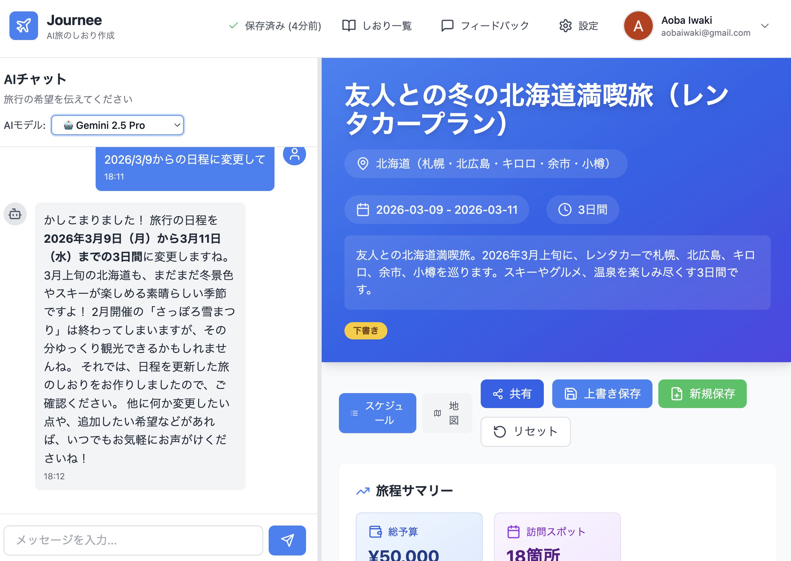
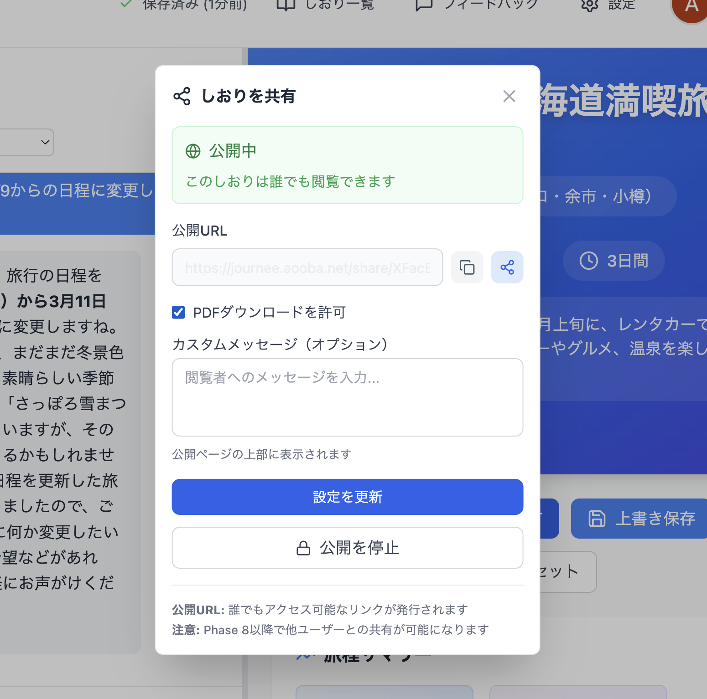
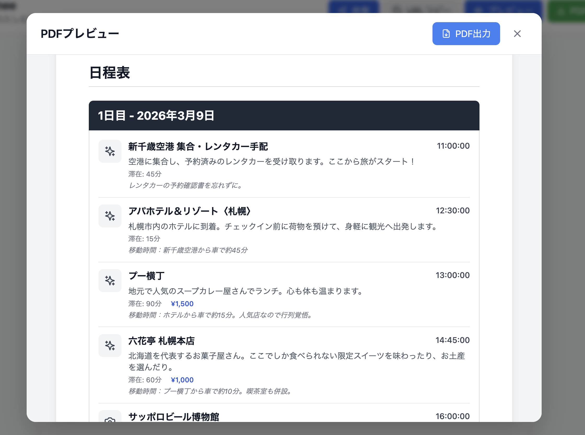
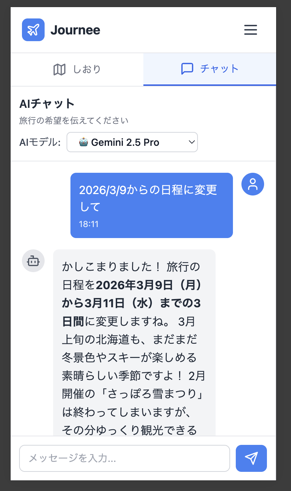

# Journee

旅行の計画をもっと楽しく、もっと簡単に。

Journeeは、まるで旅行好きの友人と話すように、AIアシスタントとチャットするだけで、あなただけの旅のしおりを作れるWebアプリケーションです。行き先を相談したり、おすすめのスポットを教えてもらったり、予算や日程を調整したり…。対話を重ねるごとに、あなたの理想の旅程が形になっていきます。

完成したしおりは、リンク一つで友人や家族と共有したり、PDFで保存して持ち歩いたり。旅行前のワクワクから、旅行中の思い出づくりまで、Journeeがあなたの旅をサポートします。

## メインページ



## 公開機能



## PDF出力機能



## モバイル対応 (PWA)



## 認証要件

Journeeのメインアプリケーション（`/`）は**認証必須**です。

- **ログインページ**: `/login`（Google OAuth）
- **認証保護**: Next.js middlewareで実装
- **未ログイン時**: 自動的に`/login`にリダイレクト

### E2Eテスト時の認証バイパス

E2Eテストでは、HTTPヘッダー`x-test-mode: 'true'`を送信することで認証をバイパスできます。

```typescript
// playwright.config.ts
use: {
  extraHTTPHeaders: {
    'x-test-mode': 'true',
  },
},
```

詳細は[docs/TESTING.md](docs/TESTING.md)を参照してください。
