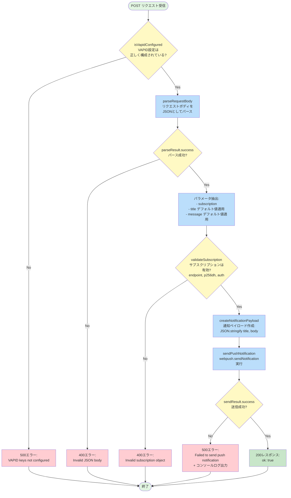

```mermaid
flowchart TD
    Start([POST リクエスト受信]) --> CheckVapid{isVapidConfigured<br/>VAPID設定は<br/>正しく構成されている?}
    
    CheckVapid -->|No| ErrorVapid[500エラー:<br/>VAPID keys not configured]
    CheckVapid -->|Yes| ParseBody[parseRequestBody<br/>リクエストボディを<br/>JSONとしてパース]
    
    ParseBody --> ParseSuccess{parseResult.success<br/>パース成功?}
    ParseSuccess -->|No| ErrorParse[400エラー:<br/>Invalid JSON body]
    ParseSuccess -->|Yes| ExtractParams[パラメータ抽出:<br/>- subscription<br/>- title デフォルト値適用<br/>- message デフォルト値適用]
    
    ExtractParams --> ValidateSub{validateSubscription<br/>サブスクリプションは<br/>有効?<br/>endpoint, p256dh, auth}
    ValidateSub -->|No| ErrorSub[400エラー:<br/>Invalid subscription object]
    ValidateSub -->|Yes| CreatePayload[createNotificationPayload<br/>通知ペイロード作成:<br/>JSON.stringify title, body]
    
    CreatePayload --> SendNotification[sendPushNotification<br/>webpush.sendNotification<br/>実行]
    
    SendNotification --> SendSuccess{sendResult.success<br/>送信成功?}
    SendSuccess -->|No| ErrorSend[500エラー:<br/>Failed to send push notification<br/>+ コンソールログ出力]
    SendSuccess -->|Yes| Success[200レスポンス:<br/>ok: true]
    
    ErrorVapid --> End([終了])
    ErrorParse --> End
    ErrorSub --> End
    ErrorSend --> End
    Success --> End
    
    style Start fill:#e1f5e1
    style End fill:#e1f5e1
    style Success fill:#c8e6c9
    style ErrorVapid fill:#ffcdd2
    style ErrorParse fill:#ffcdd2
    style ErrorSub fill:#ffcdd2
    style ErrorSend fill:#ffcdd2
    style CheckVapid fill:#fff9c4
    style ParseSuccess fill:#fff9c4
    style ValidateSub fill:#fff9c4
    style SendSuccess fill:#fff9c4
    style ParseBody fill:#bbdefb
    style ExtractParams fill:#bbdefb
    style CreatePayload fill:#bbdefb
    style SendNotification fill:#bbdefb
```