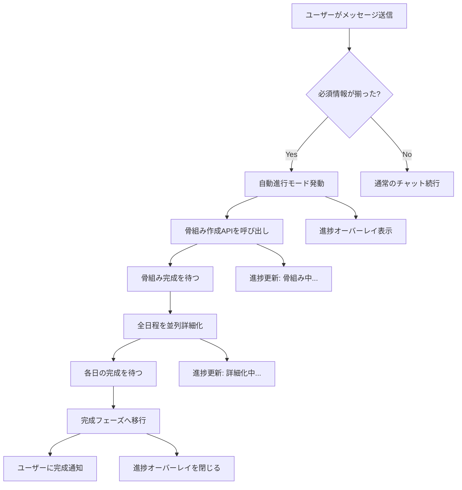

# Phase 4.10: 一気通貫作成モード - 設計書

## 📋 概要

**目的**: トリガー条件を満たしたら、ユーザーがボタンを押すことなく自動的に骨組み→詳細化→完成まで一気に作成

**背景**:
- 現在の実装では、ユーザーが「次へ」ボタンを何度も押す必要がある
- collecting → skeleton → detailing（各日） → completed と、最低でも5-10回のボタン押下が必要
- **これは体験が悪い** → 必須情報が揃った時点で、自動的に全工程を実行すべき

**解決策**:
- 必須情報（行き先、日程）が揃った瞬間に、自動進行モードを発動
- 骨組み作成 → 全日程の詳細化（並列） → 完成まで一気に実行
- ユーザーは進捗を見守るだけ（Netflix風のUX）

---

## 🎯 目標

### ユーザー体験の改善

**改善前**:
```
[ユーザー] 「東京に3泊4日で旅行に行きたいです」
    ↓
[AI] 「承知しました。どのようなテーマで...」
    ↓
[ユーザー] ボタン押下「骨組みを作成」
    ↓
[AI] 「骨組みを作成しました...」
    ↓
[ユーザー] ボタン押下「1日目の詳細化」
    ↓
[AI] 「1日目の詳細を作成しました...」
    ↓
[ユーザー] ボタン押下「2日目の詳細化」
    ↓
... （繰り返し）
    ↓
合計6-7回のボタン押下が必要 😫
```

**改善後**:
```
[ユーザー] 「東京に3泊4日で旅行に行きたいです」
    ↓
[システム] 必須情報を検出 ✓
    ↓
[自動進行開始] 🚀
    ↓
[進捗表示]
  ✓ 骨組み作成中... (10秒)
  ✓ 1-4日目を並列詳細化中... (30秒)
  ✓ 完成！
    ↓
ユーザーは待つだけ 😊
```

---

## 🏗️ アーキテクチャ

### システムフロー



### データフロー

```typescript
// 1. トリガー検出
MessageInput.handleSend()
  ↓
addMessage(userMessage)
  ↓
updateChecklist()
  ↓
checkAutoProgressTrigger()
  ↓
if (shouldAutoProgress) {
  executeFullItineraryCreation()
}

// 2. 一気通貫実行
executeFullItineraryCreation()
  ↓
setAutoProgressActive(true)
showProgressOverlay()
  ↓
await createSkeleton()
  ↓
await batchDetailAllDays()
  ↓
setAutoProgressActive(false)
hideProgressOverlay()
notifyCompletion()
```

---

## 📐 実装詳細

### 4.10.1: 自動進行トリガーシステム

#### 型定義

**ファイル**: `types/autoProgress.ts`（新規）

```typescript
/**
 * 自動進行モードの設定
 */
export interface AutoProgressSettings {
  /** 自動進行モードが有効か */
  enabled: boolean;
  
  /** 各ステップ間の待機時間（ミリ秒） */
  stepDelay: number;
  
  /** 並列詳細化の最大数 */
  maxParallelDetails: number;
  
  /** 自動進行中にユーザーメッセージを受け付けるか */
  allowUserInterrupt: boolean;
}

/**
 * 自動進行の状態
 */
export interface AutoProgressState {
  /** 自動進行中か */
  isActive: boolean;
  
  /** 現在のステップ */
  currentStep: 'idle' | 'skeleton' | 'detailing' | 'completing';
  
  /** 全体の進捗率（0-100） */
  progressRate: number;
  
  /** 現在の処理中の日 */
  processingDays: number[];
  
  /** 完了した日 */
  completedDays: number[];
  
  /** エラーが発生した日 */
  errorDays: number[];
}

/**
 * トリガー条件
 */
export interface AutoProgressTrigger {
  /** トリガーが発動するか */
  shouldTrigger: boolean;
  
  /** トリガー理由 */
  reason: string;
  
  /** 不足している情報 */
  missingInfo: string[];
}
```

#### Zustand状態管理の拡張

**ファイル**: `lib/store/useStore.ts`

```typescript
interface AppState {
  // ... 既存の状態 ...
  
  // Phase 4.10: Auto progress state
  autoProgressSettings: AutoProgressSettings;
  autoProgressState: AutoProgressState;
  
  // Actions
  setAutoProgressEnabled: (enabled: boolean) => void;
  updateAutoProgressSettings: (settings: Partial<AutoProgressSettings>) => void;
  setAutoProgressActive: (active: boolean) => void;
  updateAutoProgressState: (updates: Partial<AutoProgressState>) => void;
  checkAutoProgressTrigger: () => AutoProgressTrigger;
  executeFullItineraryCreation: () => Promise<void>;
  pauseAutoProgress: () => void;
  cancelAutoProgress: () => void;
}

// 初期状態
autoProgressSettings: {
  enabled: true,  // デフォルトで自動モード
  stepDelay: 1000,  // 1秒待機
  maxParallelDetails: 3,  // 最大3並列
  allowUserInterrupt: true,
},
autoProgressState: {
  isActive: false,
  currentStep: 'idle',
  progressRate: 0,
  processingDays: [],
  completedDays: [],
  errorDays: [],
},
```

#### トリガー検出ロジック

**ファイル**: `lib/autoProgress/trigger.ts`（新規）

```typescript
import type { AutoProgressTrigger } from '@/types/autoProgress';
import type { ChecklistStatus } from '@/types/requirements';
import type { ItineraryPhase } from '@/types/itinerary';

/**
 * 自動進行のトリガー条件をチェック
 */
export function checkAutoProgressTrigger(
  phase: ItineraryPhase,
  checklistStatus: ChecklistStatus | null,
  autoProgressEnabled: boolean
): AutoProgressTrigger {
  // 自動進行が無効の場合
  if (!autoProgressEnabled) {
    return {
      shouldTrigger: false,
      reason: '自動進行モードが無効です',
      missingInfo: [],
    };
  }
  
  // collecting フェーズでのみトリガー
  if (phase !== 'collecting') {
    return {
      shouldTrigger: false,
      reason: `フェーズ ${phase} では自動進行しません`,
      missingInfo: [],
    };
  }
  
  // チェックリスト状態がない場合
  if (!checklistStatus) {
    return {
      shouldTrigger: false,
      reason: 'チェックリスト状態が不明です',
      missingInfo: [],
    };
  }
  
  // 必須情報がすべて揃っている場合
  if (checklistStatus.allRequiredFilled) {
    return {
      shouldTrigger: true,
      reason: '必須情報が揃いました',
      missingInfo: [],
    };
  }
  
  // 必須情報が不足している場合
  return {
    shouldTrigger: false,
    reason: '必須情報が不足しています',
    missingInfo: checklistStatus.missingRequired,
  };
}

/**
 * トリガー条件を満たしているかの簡易チェック
 */
export function shouldAutoProgressNow(
  phase: ItineraryPhase,
  checklistStatus: ChecklistStatus | null,
  autoProgressEnabled: boolean
): boolean {
  const trigger = checkAutoProgressTrigger(phase, checklistStatus, autoProgressEnabled);
  return trigger.shouldTrigger;
}
```

---

### 4.10.2: 一気通貫実行エンジン

#### 実行エンジンの実装

**ファイル**: `lib/autoProgress/executor.ts`（新規）

```typescript
import type { ItineraryData } from '@/types/itinerary';
import type { ChatMessage } from '@/types/chat';
import { sendChatMessageStream } from '@/lib/utils/api-client';
import { mergeItineraryData } from '@/lib/ai/prompts';

/**
 * 一気通貫でしおりを作成
 */
export async function executeFullItineraryCreation(
  messages: ChatMessage[],
  currentItinerary: ItineraryData | null,
  callbacks: {
    onStepChange: (step: string) => void;
    onProgress: (rate: number) => void;
    onMessage: (message: ChatMessage) => void;
    onItineraryUpdate: (itinerary: ItineraryData) => void;
    onError: (error: Error) => void;
  }
): Promise<void> {
  try {
    // ステップ1: 骨組み作成
    callbacks.onStepChange('skeleton');
    callbacks.onProgress(10);
    
    const skeleton = await createSkeletonStep(messages, currentItinerary, callbacks);
    callbacks.onProgress(30);
    
    // ステップ2: 全日程の詳細化（並列）
    callbacks.onStepChange('detailing');
    
    const detailedItinerary = await detailAllDaysInParallel(
      messages,
      skeleton,
      callbacks
    );
    callbacks.onProgress(90);
    
    // ステップ3: 完成
    callbacks.onStepChange('completing');
    
    const finalItinerary = {
      ...detailedItinerary,
      status: 'completed' as const,
      phase: 'completed' as const,
    };
    
    callbacks.onItineraryUpdate(finalItinerary);
    callbacks.onProgress(100);
    
  } catch (error) {
    callbacks.onError(error as Error);
    throw error;
  }
}

/**
 * 骨組み作成ステップ
 */
async function createSkeletonStep(
  messages: ChatMessage[],
  currentItinerary: ItineraryData | null,
  callbacks: {
    onMessage: (message: ChatMessage) => void;
    onItineraryUpdate: (itinerary: ItineraryData) => void;
  }
): Promise<ItineraryData> {
  let skeletonItinerary = currentItinerary;
  let fullResponse = '';
  
  // 「骨組みを作成」メッセージを送信
  const userMessage: ChatMessage = {
    id: `auto-skeleton-${Date.now()}`,
    role: 'user',
    content: '骨組みを作成してください',
    timestamp: new Date(),
  };
  
  callbacks.onMessage(userMessage);
  
  // ストリーミングでレスポンスを取得
  for await (const chunk of sendChatMessageStream(
    userMessage.content,
    messages.slice(-10),
    currentItinerary || undefined,
    'skeleton',
    null
  )) {
    if (chunk.type === 'message' && chunk.content) {
      fullResponse += chunk.content;
    } else if (chunk.type === 'itinerary' && chunk.itinerary) {
      skeletonItinerary = mergeItineraryData(skeletonItinerary || undefined, chunk.itinerary);
      callbacks.onItineraryUpdate(skeletonItinerary);
    }
  }
  
  // AIのレスポンスをメッセージとして追加
  const assistantMessage: ChatMessage = {
    id: `auto-skeleton-response-${Date.now()}`,
    role: 'assistant',
    content: fullResponse,
    timestamp: new Date(),
  };
  
  callbacks.onMessage(assistantMessage);
  
  if (!skeletonItinerary) {
    throw new Error('骨組み作成に失敗しました');
  }
  
  return skeletonItinerary;
}

/**
 * 全日程を並列詳細化
 */
async function detailAllDaysInParallel(
  messages: ChatMessage[],
  skeleton: ItineraryData,
  callbacks: {
    onMessage: (message: ChatMessage) => void;
    onItineraryUpdate: (itinerary: ItineraryData) => void;
    onProgress: (rate: number) => void;
  }
): Promise<ItineraryData> {
  const totalDays = skeleton.duration || skeleton.schedule.length;
  const detailTasks: Promise<void>[] = [];
  let detailedItinerary = skeleton;
  let completedDays = 0;
  
  // 各日ごとに詳細化タスクを作成
  for (let day = 1; day <= totalDays; day++) {
    const task = (async () => {
      let fullResponse = '';
      
      // 「〇日目の詳細化」メッセージを送信
      const userMessage: ChatMessage = {
        id: `auto-detail-day${day}-${Date.now()}`,
        role: 'user',
        content: `${day}日目の詳細を作成してください`,
        timestamp: new Date(),
      };
      
      callbacks.onMessage(userMessage);
      
      // ストリーミングでレスポンスを取得
      for await (const chunk of sendChatMessageStream(
        userMessage.content,
        messages.slice(-10),
        detailedItinerary,
        'detailing',
        day
      )) {
        if (chunk.type === 'message' && chunk.content) {
          fullResponse += chunk.content;
        } else if (chunk.type === 'itinerary' && chunk.itinerary) {
          detailedItinerary = mergeItineraryData(detailedItinerary, chunk.itinerary);
          callbacks.onItineraryUpdate(detailedItinerary);
        }
      }
      
      // AIのレスポンスをメッセージとして追加
      const assistantMessage: ChatMessage = {
        id: `auto-detail-day${day}-response-${Date.now()}`,
        role: 'assistant',
        content: fullResponse,
        timestamp: new Date(),
      };
      
      callbacks.onMessage(assistantMessage);
      
      // 進捗を更新
      completedDays++;
      const progress = 30 + Math.round((completedDays / totalDays) * 60);
      callbacks.onProgress(progress);
    })();
    
    detailTasks.push(task);
    
    // レート制限対策: 0.5秒ずつずらして開始
    await new Promise(resolve => setTimeout(resolve, 500));
  }
  
  // すべての詳細化が完了するまで待つ
  await Promise.all(detailTasks);
  
  return detailedItinerary;
}
```

#### Zustandへの統合

**ファイル**: `lib/store/useStore.ts`（追加）

```typescript
// Phase 4.10: Execute full itinerary creation
executeFullItineraryCreation: async () => {
  const {
    messages,
    currentItinerary,
    addMessage,
    setItinerary,
    setAutoProgressActive,
    updateAutoProgressState,
    setError,
  } = get();
  
  try {
    setAutoProgressActive(true);
    updateAutoProgressState({
      currentStep: 'skeleton',
      progressRate: 0,
      processingDays: [],
      completedDays: [],
      errorDays: [],
    });
    
    await executeFullItineraryCreation(
      messages,
      currentItinerary,
      {
        onStepChange: (step) => {
          updateAutoProgressState({ currentStep: step as any });
        },
        onProgress: (rate) => {
          updateAutoProgressState({ progressRate: rate });
        },
        onMessage: (message) => {
          addMessage(message);
        },
        onItineraryUpdate: (itinerary) => {
          setItinerary(itinerary);
        },
        onError: (error) => {
          setError(error.message);
        },
      }
    );
    
    setAutoProgressActive(false);
    updateAutoProgressState({ currentStep: 'idle' });
    
  } catch (error: any) {
    console.error('Auto progress error:', error);
    setError(error.message || '自動作成中にエラーが発生しました');
    setAutoProgressActive(false);
    updateAutoProgressState({ currentStep: 'idle' });
  }
},
```

---

### 4.10.3: リアルタイム進捗表示

#### UI設計の変更

**重要**: QuickActionsの「次へ」ボタンは廃止し、代わりにしおりの段階を示す**プログレスバー（ステータスインジケーター）**を表示します。

**変更理由**:
- 自動モードでは、ユーザーがボタンを押す必要がない
- 現在どのフェーズにいるのか、視覚的にわかりやすく表示
- Netflix風の「待つだけ」体験を実現

#### フェーズステータスバー

**ファイル**: `components/itinerary/PhaseStatusBar.tsx`（新規）

```typescript
'use client';

import React from 'react';
import { useStore } from '@/lib/store/useStore';
import { Check, Loader2, Circle } from 'lucide-react';
import type { ItineraryPhase } from '@/types/itinerary';

interface PhaseStep {
  id: ItineraryPhase;
  label: string;
  description: string;
}

const PHASE_STEPS: PhaseStep[] = [
  {
    id: 'collecting',
    label: '情報収集',
    description: '旅行の基本情報を集めています',
  },
  {
    id: 'skeleton',
    label: '骨組み作成',
    description: '各日のテーマを決めています',
  },
  {
    id: 'detailing',
    label: '詳細化',
    description: '具体的な観光スポットを追加しています',
  },
  {
    id: 'completed',
    label: '完成',
    description: '旅のしおりが完成しました',
  },
];

export const PhaseStatusBar: React.FC = () => {
  const { planningPhase, autoProgressState } = useStore();
  
  const getCurrentStepIndex = () => {
    return PHASE_STEPS.findIndex(step => step.id === planningPhase);
  };
  
  const currentStepIndex = getCurrentStepIndex();
  
  return (
    <div className="bg-white border-b border-gray-200 px-6 py-4">
      {/* フェーズステップインジケーター */}
      <div className="flex items-center justify-between mb-2">
        {PHASE_STEPS.map((step, index) => {
          const isCompleted = index < currentStepIndex;
          const isCurrent = index === currentStepIndex;
          const isPending = index > currentStepIndex;
          
          return (
            <React.Fragment key={step.id}>
              {/* ステップ円 */}
              <div className="flex flex-col items-center">
                <div
                  className={`
                    w-10 h-10 rounded-full flex items-center justify-center
                    ${isCompleted ? 'bg-green-500 text-white' : ''}
                    ${isCurrent ? 'bg-blue-500 text-white' : ''}
                    ${isPending ? 'bg-gray-200 text-gray-400' : ''}
                    transition-all duration-300
                  `}
                >
                  {isCompleted && <Check className="w-5 h-5" />}
                  {isCurrent && autoProgressState.isActive && (
                    <Loader2 className="w-5 h-5 animate-spin" />
                  )}
                  {isCurrent && !autoProgressState.isActive && (
                    <Circle className="w-5 h-5 fill-current" />
                  )}
                  {isPending && <Circle className="w-5 h-5" />}
                </div>
                
                <div className="mt-2 text-center">
                  <div
                    className={`
                      text-sm font-medium
                      ${isCompleted || isCurrent ? 'text-gray-900' : 'text-gray-400'}
                    `}
                  >
                    {step.label}
                  </div>
                  {isCurrent && (
                    <div className="text-xs text-gray-500 mt-1 max-w-[120px]">
                      {step.description}
                    </div>
                  )}
                </div>
              </div>
              
              {/* 接続線 */}
              {index < PHASE_STEPS.length - 1 && (
                <div
                  className={`
                    flex-1 h-1 mx-2 rounded-full
                    ${index < currentStepIndex ? 'bg-green-500' : 'bg-gray-200'}
                    transition-all duration-300
                  `}
                />
              )}
            </React.Fragment>
          );
        })}
      </div>
      
      {/* 全体の進捗率（自動進行中のみ表示） */}
      {autoProgressState.isActive && (
        <div className="mt-4">
          <div className="flex items-center justify-between mb-1">
            <span className="text-sm font-medium text-gray-700">
              全体の進捗
            </span>
            <span className="text-sm font-medium text-blue-600">
              {autoProgressState.progressRate}%
            </span>
          </div>
          <div className="h-2 bg-gray-200 rounded-full overflow-hidden">
            <div
              className="h-full bg-blue-500 transition-all duration-500 ease-out"
              style={{ width: `${autoProgressState.progressRate}%` }}
            />
          </div>
        </div>
      )}
    </div>
  );
};
```

#### 進捗オーバーレイコンポーネント

**ファイル**: `components/autoProgress/FullProgressOverlay.tsx`（新規）

```typescript
'use client';

import React from 'react';
import { useStore } from '@/lib/store/useStore';
import { Loader2, Check, AlertCircle } from 'lucide-react';

export const FullProgressOverlay: React.FC = () => {
  const {
    autoProgressState,
    cancelAutoProgress,
  } = useStore();
  
  if (!autoProgressState.isActive) {
    return null;
  }
  
  const stepLabels = {
    idle: '',
    skeleton: '骨組みを作成中...',
    detailing: '日程の詳細を作成中...',
    completing: '仕上げ中...',
  };
  
  return (
    <div className="fixed inset-0 bg-black/50 backdrop-blur-sm z-50 flex items-center justify-center">
      <div className="bg-white rounded-2xl shadow-2xl p-8 max-w-md w-full mx-4">
        {/* ヘッダー */}
        <div className="text-center mb-6">
          <h2 className="text-2xl font-bold text-gray-900 mb-2">
            旅のしおりを作成中
          </h2>
          <p className="text-sm text-gray-600">
            しばらくお待ちください...
          </p>
        </div>
        
        {/* 進捗バー */}
        <div className="mb-6">
          <div className="h-3 bg-gray-200 rounded-full overflow-hidden">
            <div
              className="h-full bg-blue-500 transition-all duration-500 ease-out"
              style={{ width: `${autoProgressState.progressRate}%` }}
            />
          </div>
          <div className="mt-2 text-center text-sm font-medium text-gray-700">
            {autoProgressState.progressRate}%
          </div>
        </div>
        
        {/* 現在のステップ */}
        <div className="mb-6 flex items-center justify-center space-x-3">
          <Loader2 className="w-6 h-6 text-blue-500 animate-spin" />
          <span className="text-lg font-medium text-gray-900">
            {stepLabels[autoProgressState.currentStep]}
          </span>
        </div>
        
        {/* 詳細化中の日リスト */}
        {autoProgressState.currentStep === 'detailing' && (
          <div className="mb-6">
            <div className="grid grid-cols-4 gap-2">
              {Array.from({ length: autoProgressState.processingDays.length + autoProgressState.completedDays.length }).map((_, i) => {
                const day = i + 1;
                const isCompleted = autoProgressState.completedDays.includes(day);
                const isProcessing = autoProgressState.processingDays.includes(day);
                const hasError = autoProgressState.errorDays.includes(day);
                
                return (
                  <div
                    key={day}
                    className={`
                      px-3 py-2 rounded-lg text-center text-sm font-medium
                      ${isCompleted ? 'bg-green-100 text-green-700' : ''}
                      ${isProcessing ? 'bg-blue-100 text-blue-700' : ''}
                      ${hasError ? 'bg-red-100 text-red-700' : ''}
                      ${!isCompleted && !isProcessing && !hasError ? 'bg-gray-100 text-gray-400' : ''}
                    `}
                  >
                    {isCompleted && <Check className="w-4 h-4 inline mr-1" />}
                    {hasError && <AlertCircle className="w-4 h-4 inline mr-1" />}
                    {day}日目
                  </div>
                );
              })}
            </div>
          </div>
        )}
        
        {/* キャンセルボタン */}
        <button
          onClick={cancelAutoProgress}
          className="w-full px-4 py-3 border border-gray-300 text-gray-700 rounded-lg hover:bg-gray-50 transition-colors"
        >
          キャンセル
        </button>
      </div>
    </div>
  );
};
```

---

### 4.10.4: ユーザー制御機能

#### 一時停止・キャンセル機能

**ファイル**: `lib/store/useStore.ts`（追加）

```typescript
// Pause auto progress
pauseAutoProgress: () => {
  const { autoProgressState } = get();
  if (autoProgressState.isActive) {
    // 現在のステップを完了してから停止
    set({
      autoProgressSettings: {
        ...get().autoProgressSettings,
        enabled: false,  // 一時的に無効化
      },
    });
  }
},

// Cancel auto progress
cancelAutoProgress: () => {
  if (confirm('自動作成をキャンセルしますか？作成途中のしおりは保持されます。')) {
    set({
      autoProgressState: {
        isActive: false,
        currentStep: 'idle',
        progressRate: 0,
        processingDays: [],
        completedDays: [],
        errorDays: [],
      },
    });
  }
},
```

#### QuickActionsの廃止

**重要な変更**: QuickActionsコンポーネントの「次へ」ボタンは廃止します。

**理由**:
- 自動モードがデフォルトのため、ボタンは不要
- フェーズの遷移は自動的に行われる
- ユーザーは進捗をPhaseStatusBarで確認できる

**代替UI**: `components/itinerary/AutoModeNotification.tsx`（新規）

```typescript
'use client';

import React from 'react';
import { useStore } from '@/lib/store/useStore';
import { Zap, Settings } from 'lucide-react';

export const AutoModeNotification: React.FC = () => {
  const {
    autoProgressSettings,
    buttonReadiness,
    planningPhase,
  } = useStore();
  
  // 自動モードが有効で、必須情報が揃った場合のみ表示
  if (!autoProgressSettings.enabled || 
      buttonReadiness?.level !== 'ready' ||
      planningPhase !== 'collecting') {
    return null;
  }
  
  return (
    <div className="bg-gradient-to-r from-blue-50 to-green-50 border border-blue-200 rounded-lg p-4 mx-4 mb-4">
      <div className="flex items-start space-x-3">
        <Zap className="w-6 h-6 text-blue-600 mt-0.5 flex-shrink-0" />
        <div className="flex-1">
          <h4 className="font-semibold text-blue-900 mb-1">
            準備完了！
          </h4>
          <p className="text-sm text-blue-800 mb-3">
            必須情報が揃いました。メッセージを送信すると、自動的にしおりを作成します。
          </p>
          <div className="flex items-center space-x-2 text-xs text-blue-700">
            <Settings className="w-4 h-4" />
            <span>自動作成モード ON</span>
          </div>
        </div>
      </div>
    </div>
  );
};
```

**統合**: `components/itinerary/ItineraryPreview.tsx`に追加

```typescript
import { PhaseStatusBar } from './PhaseStatusBar';
import { AutoModeNotification } from './AutoModeNotification';

export const ItineraryPreview: React.FC = () => {
  return (
    <div className="flex flex-col h-full">
      {/* ヘッダー */}
      <div className="border-b bg-white p-4">
        <h2 className="text-xl font-bold">旅のしおり</h2>
      </div>
      
      {/* フェーズステータスバー */}
      <PhaseStatusBar />
      
      {/* 自動モード通知 */}
      <AutoModeNotification />
      
      {/* しおりコンテンツ */}
      <div className="flex-1 overflow-y-auto">
        {/* ... 既存のコンテンツ ... */}
      </div>
    </div>
  );
};
```

---

### 4.10.5: 設定とカスタマイズ

#### 設定パネル

**ファイル**: `components/settings/AutoProgressSettings.tsx`（新規）

```typescript
'use client';

import React from 'react';
import { useStore } from '@/lib/store/useStore';

export const AutoProgressSettings: React.FC = () => {
  const {
    autoProgressSettings,
    updateAutoProgressSettings,
  } = useStore();
  
  return (
    <div className="bg-white rounded-lg border p-6">
      <h3 className="text-lg font-semibold mb-4">自動作成設定</h3>
      
      {/* 自動モードON/OFF */}
      <div className="mb-4">
        <label className="flex items-center space-x-3">
          <input
            type="checkbox"
            checked={autoProgressSettings.enabled}
            onChange={(e) => updateAutoProgressSettings({ enabled: e.target.checked })}
            className="w-5 h-5 rounded border-gray-300"
          />
          <span className="text-sm font-medium text-gray-900">
            自動作成モードを有効にする
          </span>
        </label>
        <p className="mt-1 text-xs text-gray-500 ml-8">
          必須情報が揃ったら、自動的にしおりを作成します
        </p>
      </div>
      
      {/* 並列数 */}
      <div className="mb-4">
        <label className="block text-sm font-medium text-gray-700 mb-2">
          並列詳細化の最大数
        </label>
        <select
          value={autoProgressSettings.maxParallelDetails}
          onChange={(e) => updateAutoProgressSettings({ maxParallelDetails: Number(e.target.value) })}
          className="w-full px-3 py-2 border border-gray-300 rounded-lg"
        >
          <option value={1}>1（順次）</option>
          <option value={2}>2</option>
          <option value={3}>3（推奨）</option>
          <option value={5}>5</option>
        </select>
      </div>
    </div>
  );
};
```

---

## 🎯 期待される効果

### ボタン押下回数の削減

| しおりの日数 | 改善前 | 改善後 | 削減率 |
|------------|-------|-------|--------|
| 3泊4日 | 6回 | 0回 | 100% |
| 4泊5日 | 7回 | 0回 | 100% |
| 6泊7日 | 9回 | 0回 | 100% |

### 所要時間の短縮

Phase 4.9（並列化）と組み合わせることで：

| しおりの日数 | 従来（逐次） | Phase 4.9（並列） | Phase 4.10（自動） |
|------------|------------|-----------------|------------------|
| 3泊4日 | 120秒 | 50秒 | **45秒（自動）** |
| 4泊5日 | 150秒 | 60秒 | **55秒（自動）** |
| 6泊7日 | 210秒 | 80秒 | **75秒（自動）** |

### UXの向上

- ✅ ボタンを押す手間がゼロ
- ✅ AIに必要情報を伝えるだけで完結
- ✅ 進捗が視覚的にわかる
- ✅ Netflix風の「待つだけ」体験

---

## 🧪 テストシナリオ

### シナリオ1: 正常系（自動作成成功）

```
1. ユーザー: 「東京に3泊4日で旅行に行きたいです」
2. システム: 必須情報を検出 ✓
3. システム: 自動進行モード発動
4. 進捗オーバーレイ表示:
   - [10%] 骨組み作成中...
   - [30%] 骨組み完成 ✓
   - [40%] 1日目詳細化中...
   - [55%] 2日目詳細化中...
   - [70%] 3日目詳細化中...
   - [85%] 4日目詳細化中...
   - [90%] すべての日が完成 ✓
   - [100%] 完成！
5. オーバーレイが閉じて、完成したしおりが表示される
```

### シナリオ2: 途中でキャンセル

```
1. 自動作成開始
2. [50%] 骨組み完成、詳細化中...
3. ユーザー: 「キャンセル」ボタンをクリック
4. 確認ダイアログ: 「キャンセルしますか？」
5. ユーザー: 「はい」
6. 自動作成停止、骨組みまでのしおりは保持
```

### シナリオ3: 手動モードに切り替え

```
1. ユーザー: 「京都に2泊3日で」
2. システム: 必須情報検出 ✓
3. 通知: 「自動的にしおりを作成します」
4. ユーザー: 「手動モードに切り替え」をクリック
5. 自動進行がキャンセルされ、QuickActionsボタンが表示される
```

---

## 📋 実装チェックリスト

### Phase 4.10.1: トリガーシステム
- [ ] `types/autoProgress.ts` の作成
- [ ] `lib/autoProgress/trigger.ts` の実装
- [ ] Zustand状態管理の拡張
- [ ] LocalStorageへの設定保存

### Phase 4.10.2: 実行エンジン
- [ ] `lib/autoProgress/executor.ts` の実装
- [ ] `executeFullItineraryCreation` 関数
- [ ] `createSkeletonStep` 関数
- [ ] `detailAllDaysInParallel` 関数
- [ ] Zustandへの統合

### Phase 4.10.3: 進捗表示
- [ ] `PhaseStatusBar` コンポーネント（フェーズステータスバー）
- [ ] `AutoModeNotification` コンポーネント（自動モード通知）
- [ ] `FullProgressOverlay` コンポーネント（全画面進捗）
- [ ] プログレスバーのアニメーション
- [ ] 各日の状態表示
- [ ] QuickActionsコンポーネントの削除/非表示化

### Phase 4.10.4: ユーザー制御
- [ ] 一時停止機能
- [ ] キャンセル機能
- [ ] 確認ダイアログ

### Phase 4.10.5: 設定UI
- [ ] `AutoProgressSettings` コンポーネント
- [ ] QuickActionsの修正
- [ ] モード切り替えUI

---

## 🚀 次のステップ

1. **Phase 4.10.1の実装**: トリガーシステム
2. **Phase 4.10.2の実装**: 実行エンジン
3. **Phase 4.10.3の実装**: 進捗表示UI
4. **Phase 4.10.4の実装**: ユーザー制御
5. **Phase 4.10.5の実装**: 設定UI

---

**優先度**: 🔥 最高（UX改善の最重要項目）  
**依存**: Phase 4.9（並列化）との統合で最大効果  
**実装難易度**: ⭐⭐⭐ 中  
**影響範囲**: MessageInput, QuickActions, Zustand, 新規コンポーネント

---

**関連ドキュメント**:
- [Phase 4.9: 並列化](./PHASE4_9_PARALLEL_DAY_CREATION.md)
- [Phase 4.8: 自動フェーズ移動](./PHASE4_8_AUTO_PHASE_TRANSITION.md)